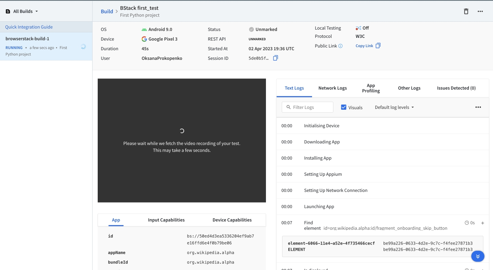
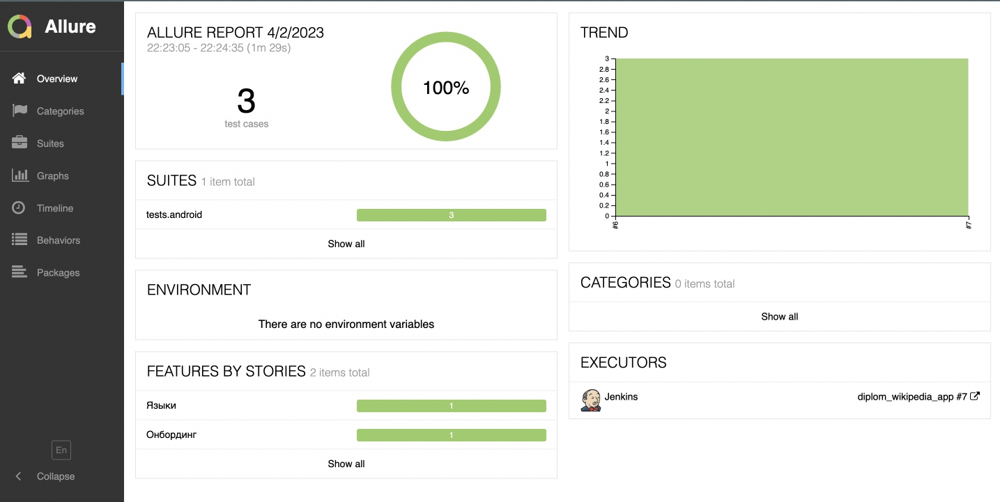
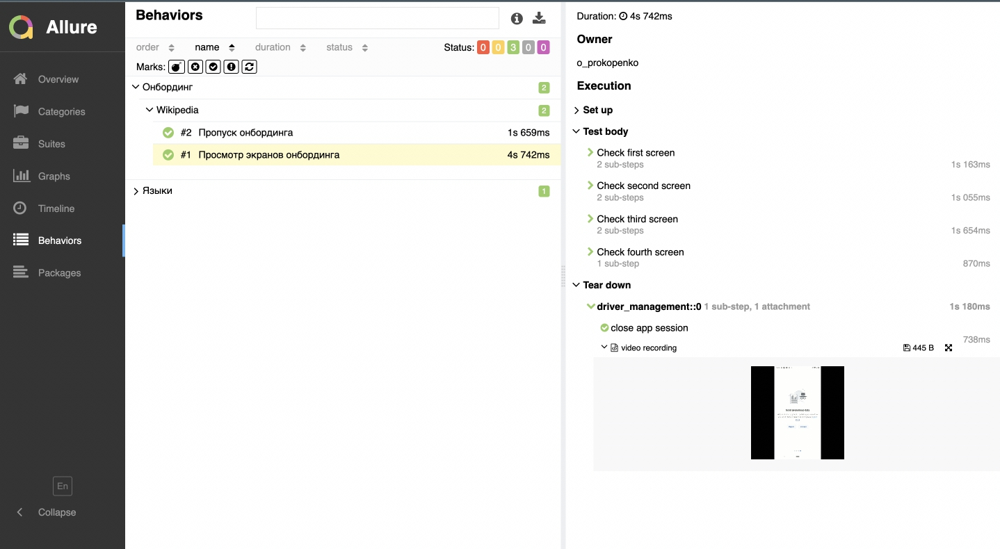
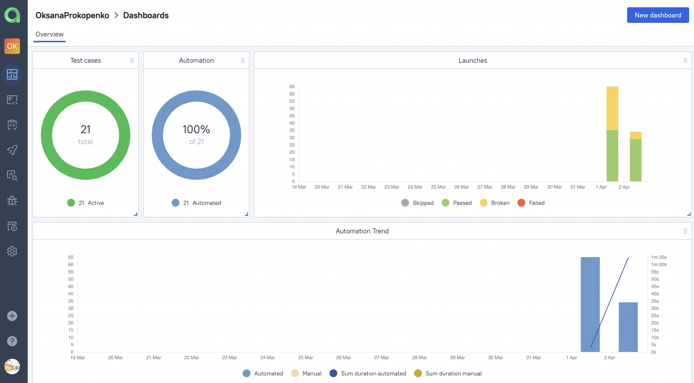
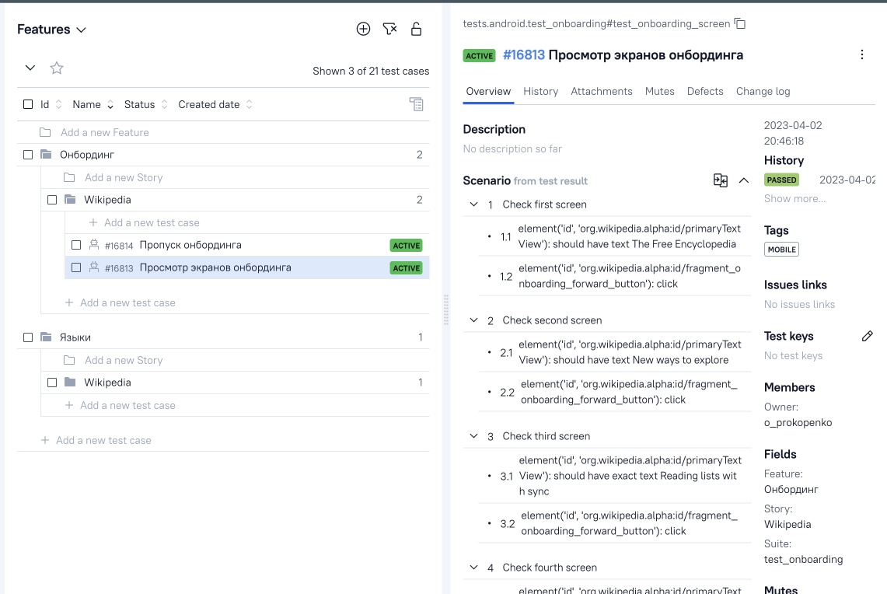
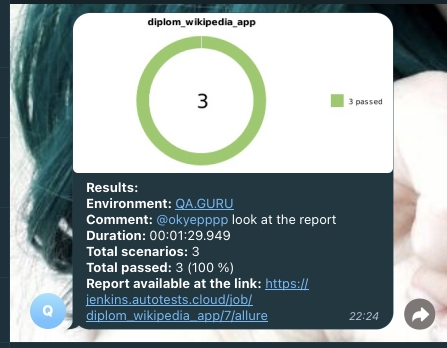

## Проект Mobile автотестов для приложения Wikipedia
### Используемые технологии

<code></code>
<code></code>
<code></code>
<code></code>
<code></code>
<code></code>
<code></code>
<code></code>
<code></code>
<code></code>
<code></code>

  

### Что проверяют тесты
* Онбординг
* Главный экран
* Смена языка
 

### Тесты можно запускать в разных вариациях: 
* Для запуск на эмуляторе в терминале необходимо выполнить команду: <env -S "context=emulation" pytset .>
* Для запуск в browserstack(указав соответсвующее креды в конфиге): <env -S "context=emulation" pytset .>
* Для запуска на подключенном реальном устройстве: <env -S "context=real" pytset .>

###  [Запуск проекта в Jenkins](https://jenkins.autotests.cloud/user/oksana/builds)
##### При нажатии на "Собрать сейчас" начнется сборка тестов и их прохождение на сервере Jenkins.

###  Запуск проекта в Browserstack
##### После запуска сборки в Jenkins, тесты начинают проходить удаленно через Browserstack. Где в реальном времени можно следить за прохождением теста через логи.

###  Allure report
##### После прохождения тестов, результаты можно посмотреть в Allure отчете.

##### Во вкладке Behaviors находятся собранные тест кейсы, у которых описаны шаги. По окончанию выполнения делается видеозапись прогона теста.

##### Видео теста "Прохождение онбординга".

###  [Интеграция с Allure TestOps](https://allure.autotests.cloud/project/2094/dashboards)

##### Так же вся отчетность сохраняется в Allure TestOps, где строятся аналогичные графики.

#### Во вкладке со сьютами, мы можем:
- Управлять всеми тест-кейсами или с каждым отдельно
- Перезапускать каждый тест отдельно от всех тестов
- Настроить интеграцию с Jira
- Добавлять ручные тесты и т.д

###  Интеграция с Telegram
##### После прохождения тестов, в Telegram bot приходит сообщение с графиком и небольшой информацией о тестах.

